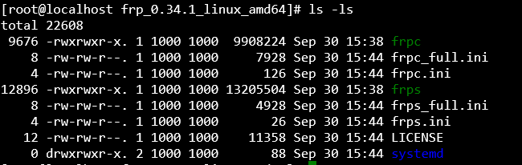

## 前期需要软件
1. 远程SSH控制台软件（本教程使用 Remote Terminal 此为win10商店软件）[[点我下载(此软件为Xshell)]](https://www.lanzoui.com/i88wyvi)
2. 支持Sftp的FTP软件（本教程使用 FileZilla）[[点我下载]](https://www.lanzoui.com/i88wyqd)
3. 公网IP必须要有
4. Windows、Centos或Ubuntu等主机一台

> frp项目地址 ==> [[点击跳转]](https://github.com/fatedier/frp)

## 项目后缀含义
| **下载名**                         | **含义**                      |
|---------------------------------|-----------------------------|
| frp_x.x.x_darwin_amd64.tar.gz   | MacOs操作系统                   |
| frp_x.x.x_freebsd_386.tar.gz    | UNIX操作系统x86                 |
| frp_x.x.x_freebsd_amd64.tar.gz  | UNIX操作系统x64                 |
| frp_x.x.x_linux_386.tar.gz      | Linux操作系统x86                |
| frp_x.x.x_linux_amd64.tar.gz    | Linux操作系统x64                |
| frp_x.x.x_linux_arm.tar.gz      | ARM架构为硬核的处理器                |
| frp_x.x.x_linux_arm64.tar.gz    | ARM架构为硬核的处理器                |
| frp_x.x.x_linux_mips.tar.gz     | mips是big-endian的mips架构      |
| frp_x.x.x_linux_mips64.tar.gz   | mips是big-endian的mips架构      |
| frp_x.x.x_linux_mips64le.tar.gz | mipsel是little-endian的mips架构 |
| frp_x.x.x_linux_mipsle.tar.gz   | mipsel是little-endian的mips架构 |
| frp_x.x.x_windows_386.zip       | Windows操作系统x86              |
| frp_x.x.x_windows_amd64.zip     | Windows操作系统x64              |


## 使用方法
### 版本我们只需要知道这几个就行
| **下载名**                      | **含义**         |
|------------------------------|----------------|
| frp_x.x.x_linux_386.tar.gz   | Linux操作系统x86   |
| frp_x.x.x_linux_amd64.tar.gz | Linux操作系统x64   |
| frp_x.x.x_windows_386.zip    | Windows操作系统x86 |
| frp_x.x.x_windows_amd64.zip  | Windows操作系统x64 |

- 应用包下载页[[点击跳转]](https://github.com/fatedier/frp/releases)
### 客户端配置文件
- 程序会使用`frpc.ini`配置文件

:::: code-group
::: code-group-item frpc.ini
@[code](./file/frpc.ini)
:::
::: code-group-item frpc_full.ini
@[code](./file/frpc_full.ini)
:::
::::

### 服务端配置文件
- 程序会使用frps.ini配置文件

:::: code-group
::: code-group-item frps.ini
@[code](./file/frps.ini)
:::
::: code-group-item frps_full.ini
@[code](./file/frps_full.ini)
:::
::::

## 各个系统使用说明
::: danger
1. 虽说是分系统的程序的，但是两者通信可以互通，所以你是可以使用两个不同的系统来进行
2. 如不会请将配置文件在两者服务器同步更新(都重新写一遍)，但如果你知道咋整。。你可以轻松很多
:::

### Windows
1. 下载我们的应用包[点击跳转](https://github.com/fatedier/frp/releases)
2. 解压后我们会得到他的程序文件，首先我们需要修改他的配置

- 比如我要映射JAVA版我的世界服务器(当然额外设置你可以看我上面的说明)

::: tip 以下为演示内容
:::
:::: code-group
::: code-group-item frpc.ini
```ini
[common]
server_addr = xxxx
server_port = 7000
token = xxxxx

[我的世界服务器]
type = tcp
local_ip = 127.0.0.1
local_port = 25565
remote_port = 25565
```
:::
::: code-group-item frps.ini
```ini
[common]
bind_port = 7000
token = xxxxx
```
:::
::::

3. 将他们复制到你要映射的服务器和被映射的服务器、电脑。执行相应的指令
- Windows 用户，需要在 `cmd` 终端中执行命令
```bash
./frps.exe -c ./frps.ini
# 服务端执行指令
./frpc.exe -c ./frpc.ini
# 客户端执行指令
```

### Centos Ubuntu Debian
1. 下载我们的应用包[点击跳转](https://github.com/fatedier/frp/releases)
- 比如我会直接复制他的链接使用wget下载并解压
```bash
yum install -y wget
# Centos
apt install wget -y
# Ubuntu Debian
# 安装所需工具
wget https://github.com/fatedier/frp/releases/download/v0.34.1/frp_0.34.1_linux_amd64.tar.gz
# 下载你所需的版本，链接请自行获取
```
2. 解压后我们会得到他的程序文件，首先我们需要修改他的配置
```bash
tar -xzvf frp_0.34.1_linux_amd64.tar.gz
# 解压文件 [文件名请注意，是你上面下载的链接]
cd frp_0.34.1_linux_amd64
# 注意是你上面解压出来的文件目录
```
3. 解压后我们会得到他的程序文件，首先我们需要修改他的配置

比如我要映射JAVA版我的世界服务器(当然额外设置你可以看我上面的说明)
建议使用 `nano` 来进行编辑
```bash
yum install nano -y
# Centos系统使用
apt install nano -y
# Ubuntu
apt install nano -y
# Debian貌似自带？
nano frpc.ini
nano frps.ini
# 直接就可以编辑，Ctrl+X 退出，它会提示是否需要保存，按 Y 即可，再按回车即可完成
```

::: tip 以下为演示内容
:::
:::: code-group
::: code-group-item frpc.ini
```ini
[common]
server_addr = xxxx
server_port = 7000
token = xxxxx

[我的世界服务器]
type = tcp
local_ip = 127.0.0.1
local_port = 25565
remote_port = 25565
```
:::
::: code-group-item frps.ini
```ini
[common]
bind_port = 7000
token = xxxxx
```
:::
::::

3. 将他们复制到你要映射的服务器和被映射的服务器、电脑。执行相应的指令
```bash
./frps -c ./frps.ini
# 服务端执行指令
./frpc -c ./frpc.ini
# 客户端执行指令
```