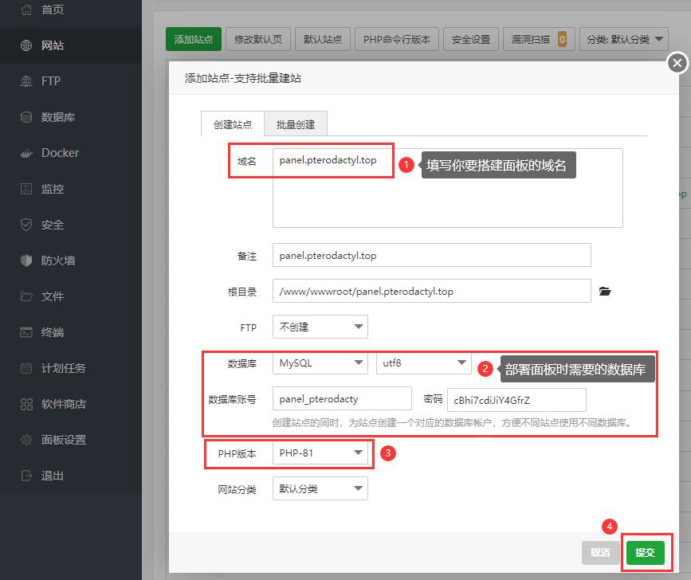
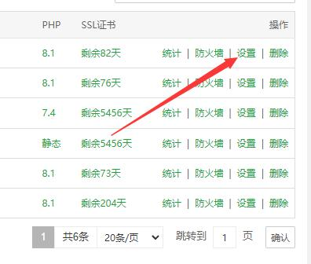

::: theorem
我参与了此项目的汉化，而我是负责面板的开发版汉化（此开发版非比开发版），如果上游仓库更新，这里会同步更新，当然，我在使用过程中出现问题我也会第一时间去修复这些。现阶段更新频率降低（毕竟能汉化的基本汉化完了）。
::: right
详情请参阅[翼龙中国文档](https://pterodactyl.top)
:::

## 选择服务器操作系统

翼龙可在多种操作系统上运行，因此请选择最适合您使用的操作系统。

::: warning
由于与 Docker 不兼容，翼龙不支持大多数 OpenVZ 系统。如果您计划在基于 OpenVZ 的系统上运行此软件，您将很大概率不会成功。  
不过翼龙面板前端就没那么需求了，只要阁下前端服务器能装 `BT-Panel`，和 `LNMP` 或者 `LAMP`，就可以用来搭建翼龙面板前端了。一般服务器均能满足前端的搭建要求。
:::

| 操作系统   | 版本  |      支持状况      | 注意事项                           |
|:-----------|:------|:------------------:|:-----------------------------------|
| **Ubuntu** | 18.04 | :white_check_mark: | 文档基于 Ubuntu 18.04 作为操作系统所编写的。 |
|            | 20.04 | :white_check_mark: |                                    |
|            | 22.04 | :white_check_mark: | MariaDB 无需 repo 安装脚本即可安装。 |
| **CentOS** | 7     | :white_check_mark: | 需要额外的 repos。                 |
|            | 8     | :white_check_mark: | 请注意，CentOS 8 已停运。使用 Rocky 或 Alma Linux。 |
| **Debian** | 10    | :white_check_mark: |                                    |
|            | 11    | :white_check_mark: |                                    |

## 安装宝塔面板
此界面提供的安装脚本具有时间局限性，可能落后于官方最新版本，有条件的话请去宝塔官网查看


``` bash
# Centos安装脚本
yum install -y wget && wget -O install.sh http://download.bt.cn/install/install_6.0.sh && sh install.sh ed8484bec

# Ubuntu/Deepin安装脚本
wget -O install.sh http://download.bt.cn/install/install-ubuntu_6.0.sh && sudo bash install.sh ed8484bec

# Debian安装脚本
wget -O install.sh http://download.bt.cn/install/install-ubuntu_6.0.sh && bash install.sh ed8484bec

# 万能安装脚本
if [ -f /usr/bin/curl ];then curl -sSO https://download.bt.cn/install/install_panel.sh;else wget -O install_panel.sh https://download.bt.cn/install/install_panel.sh;fi;bash install_panel.sh ed8484bec
```

## 安装LNMP或LAMP基础环境

`LNMP` 和 `LAMP` 分别代表着 `Linux` `Nginx\Apache` `Mysql` `PHP`   
阁下选择版本请务必保证 `PHP`版本 >=  `8.1`、 `MySQL`版本 >=  `5.7`    
这一般会在阁下第一次登录宝塔面板时提示安装，我不在此赘述，若阁下错过提示，可点击 `软件商店` 自行安装    
在安装完毕后，在 `PHP` 的**禁用函数**里删除 `putenv`、 `exec`、 `proc_open`、 `shell_exec`，并且在扩展里安装 `fileinfo` `redis`

## 新建站点并开始构建

### 新建站点
我觉得你应该会使用宝塔面板来新建一个网站



### 下载并上传程序文件至网站目录

``` bash
https://github.com/pterodactyl-china/panel/releases/latest/download/panel.tar.gz
# 如果阁下下不动这个文件，可以使用 gh-proxy 提供的CF反向代理来下载 链接如下
https://ghproxy.com/https://github.com/pterodactyl-china/panel/releases/latest/download/panel.tar.gz
```

### 进入网站目录解压程序文件并设置环境文件

现在所有文件都已下载，我们需要进入网站目录解压刚刚上传的 `panel.tar.gz` 压缩包

然后将 `.env.example`  文件重命名为 `.env`

### 使用 Composer 安装相关依赖

点击 网站的 `设置` ，再点击 `设置` 里的 `Composer`  



先点击 `升级Composer` 确保其为最新版本，并按红圈所示选择  
在 `补充命令` 中输入以下命令后点击 `执行` ，等待命令执行完成后关闭窗口即可。
```
composer install --no-dev --optimize-autoloader
```


::: warning
在进行以下步骤之前，请阁下为面板前端新建一个数据库，我相信阁下的聪明脑袋一定会用宝塔面板新建一个数据库吧。
:::

### 伪静态及二级目录设置
点击 网站的 `设置` ，进入设置界面


#### 伪静态设置
点击 `设置` 里的 `伪静态`  


先点击左上角的伪静态模板，并使用 `laravel5` 伪静态模板
点击 `保存` 即可设置成功。

#### 二级目录设置
点击 `设置` 里的 `网站目录` 


点击 `运行目录` 一栏，并选择 `/public`
点击 `保存` 即可设置成功。

### 生成APP_KEY并进行环境配置

现在我们要开始输入一些指令了，请阁下先记住在宝塔新建站点时设置的站点目录

``` bash
#进入站点目录
cd {阁下在宝塔新建站点时设置的站点目录}
# 例如 cd /www/wwwroot/pterodactyl

# 注意，以下指令仅针对于第一次安装部署翼龙面板前端
# 且对应数据库内无数据时执行，若阁下并非第一次安装且数据库内有数据，请忽略此指令
php artisan key:generate --force
```

``` bash
#下面两个指令是设置一些基础信息和数据库配置，阁下应该在此步骤之前为面板前端新建一个数据库
php artisan p:environment:setup
php artisan p:environment:database

# 下面这个指令是配置面板的发件系统，如果阁下不需要可忽略
# 若使用 PHP 自带的 mail 拓展 (不推荐使用), 请在执行以下指令后选择 "mail"。
# 若使用自定义 SMTP 服务器，请在执行以下指令后选择 "smtp"。
php artisan p:environment:mail
```

现在我们要将面板所有的核心数据写入我们之前为面板准备的数据库内。

**此步骤可能花费较长时间来进行执行，花费的时间取决于您的主机性能，主机与数据库主机的网络连接状态等因素。请耐心等待数据导入完成，切勿中途使用 CTRL+C 强制中断执行！**

``` bash
php artisan migrate --seed --force
```

### 添加首位用户

数据库配置完成后，您需要为面板创建一个管理用户，以便您可以登录面板。 为此，请运行以下命令。 并保证账户密码满足以下要求：8 个字符，大小写混合，至少一个数字。

``` bash
php artisan p:user:make
```

### 设置程序文件权限

我们需要进入网站目录并全选设置文件权限为 `755` 所有者为 `www`


## 注册队列监听服务

我们使用队列来使应用程序更快，并在后台处理发送电子邮件和其他操作。您需要设置工作队列以处理这些操作。

### Crontab 定时任务设置

我们需要做的第一件事是创建一个新的 Cronjob，它每分钟运行一次以处理特定的任务，例如会话清理并将计划任务发送到守护进程。 您需要使用 `sudo crontab -e` 打开您的 `crontab`，然后将以下字符串以新一行粘贴进去，并保存更改。

```bash
* * * * * php /www/wwwroot/pterodactyl/artisan schedule:run >> /dev/null 2>&1
```

### 创建队列监听服务

接下来，您需要创建一个新的 systemd 来保持我们的队列进程在后台运行。 该队列负责发送电子邮件并为翼龙面板处理许多其他后台任务。

在 `/etc/systemd/system` 文件夹中创建一个名为 `pteroq.service` 的文件，其内容如下。

``` text {6,14}
# 翼龙工作队列文件
# ----------------------------------

[Unit]
Description=Pterodactyl Queue Worker
# After=redis-server.service

[Service]
# 在某些系统上用户和组可能不同。
# 有些系统使用 `apache` 或 `nginx` 作为用户和组。
User=www
Group=www
Restart=always
ExecStart=/usr/bin/php /www/wwwroot/pterodactyl/artisan queue:work --queue=high,standard,low --sleep=3 --tries=3
StartLimitInterval=180
StartLimitBurst=30
RestartSec=5s

[Install]
WantedBy=multi-user.target
```

::: tip CentOS 上的 Redis
如果您使用的是 CentOS，则需要在 `After=` 一行将 `redis-server.service` 替换为 `redis.service`，以确保 `redis` 在工作队列之前启动。
:::

::: tip
如果你没有使用 `redis` 做任何事情，你应该删除 `After=` 一行，否则服务启动时会遇到错误。      
如果你的面板路径并不是 `/www/wwwroot/pterodactyl/`，请替换为你面板的绝对路径，否则邮件服务将无法使用。      
如果你宝塔默认命令行使用的并不是 `8.1`PHP 可以尝试使用绝对路径，将 `/usr/bin/php` 改为 `/www/server/php/81/bin/php`
:::

如果您在系统中使用 redis，则需要确保启用它会在引导时启动。您可以通过运行以下命令来执行此操作：

```bash
sudo systemctl enable --now redis-server
```

最后，启动队列监听服务并设置开启自动启动

``` bash
sudo systemctl enable --now pteroq.service
```