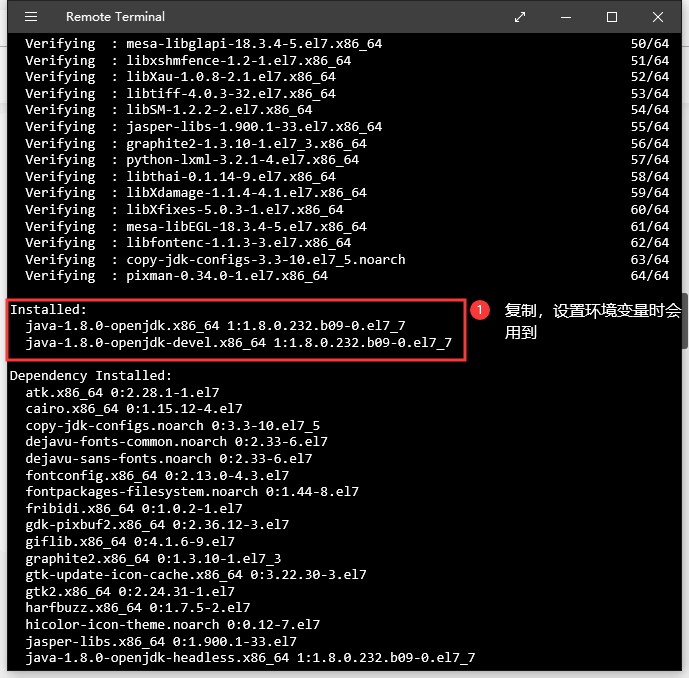
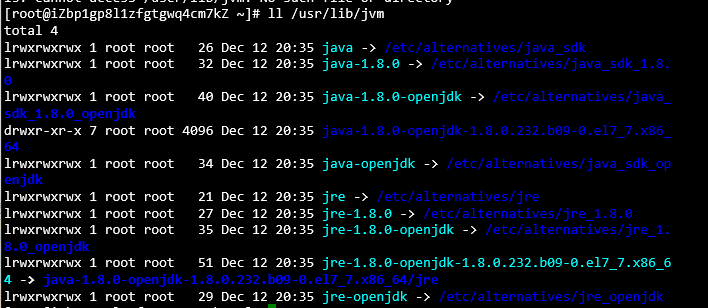
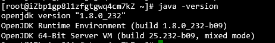
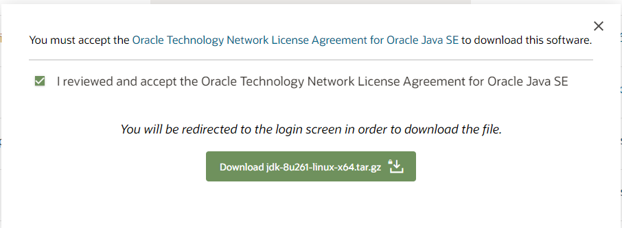

## Centos
使用`yum`安装`java8`。

1. 查看`java`版本库
```bash
yum search java | grep jdk
# 这里选择Java8
yum install java-1.8.0-openjdk java-1.8.0-openjdk-devel
```

::: details 在新的编译版本可以不用配置了，但旧版可能还是需要配置

安装完毕后如下图，需复制图中箭头指向的名称，`java8`完整版本名称。后面设置环境变量会用到。



2. 查看`java8`安装位置 # (Centos)

通过此方法安装的java放在固定位置
```bash
ll /usr/lib/jvm
```


3. 设置环境变量 # (Centos)
```bash
vi /etc/profile
```
编辑该文件，在末尾加上如下内容：（jdk版本需自行填写，上面复制的版本）
```bash {2}
#set java environment
JAVA_HOME=/user/lib/jvm/java-1.8.0-openjdk-1.8.0.232.b09-0.el7_7.x86_64
JRE_HOME=$JAVA_HOME/jre
CLASS_PATH=.:$JAVA_HOME/lib/dt.jar:$JAVA_HOME/lib/tools.jar:$JRE_HOME/lib
PATH=$PATH:$JAVA_HOME/bin:$JRE_HOME/bin
export JAVA_HOME JRE_HOME CLASS_PATH PATH
```
按“i”键进行编辑，退出先按“ESC”然后“:”
- :q 是直接退出
- :wq 保存后退出
- :q! – 不保存内容， 强制退出
4. 刷新配置，使其生效 # (Centos)
```bash
source /etc/profile
```
:::
5. 查看`java`版本
```bash
java -version
```
如下图则安装成功。



## Ubuntu
1. 安装`java8`
```bash
apt install openjdk-8-jdk
```
2. 如果我们在服务器上安装了多个Java版本，我们可以使用<b>update-alternatives</b>系统更改默认版本
```bash
sudo update-alternatives --config java
```
要维持当前值[*]请按<回车键>，或者键入选择的编号：<br>
在出现提示时输入号码并按Enter键。

3. 查看`java`版本
```bash
java -version
```

## Debian
1. 首先去官网去下载所需要的jdk包 [点击我跳转](http://www.oracle.com/technetwork/java/javase/downloads/jdk8-downloads-2133151.html)



没有的注册一个就好了，下载过程可能有些缓慢，慢慢等待就好

::: details 博主的一些小提示
- 上面的方法是下载到本地再上传到服务器，这个方法速度很慢且中间需要你再手动上传到服务器
- 在你点击登录时会直接帮你跳转进行下载，他会给你一个链接，你只要把链接复制下来使用wget即可
``` bash
wget https://download.oracle.com/otn/java/jdk/8u261-b12/a4634525489241b9a9e1aa73d9e118e6/jdk-8u261-linux-x64.tar.gz?AuthParam=1601534459_d2b72ea23c956e47cd64c8b8dc5d868b
# 需要注意此链接不是永久性的，原因自行网上查阅
mv jdk-8u261-linux-x64.tar.gz?AuthParam=1601534459_d2b72ea23c956e47cd64c8b8dc5d868b jdk-8u261-linux-x64.tar.gz
# 再将名称进行更改成正常的名称
```
:::

2. 解压并放置所需目录中
``` bash
mkdir /usr/lib/jvm
# 创建目录
tar zxvf jdk-8u261-linux-x64.tar.gz -C /usr/lib/jvm
# 解压至上面的目录中[请注意文件名称，需自行修改]
```

3. 设置环境变量
```
nano ~/.bashrc
```
编辑该文件，在末尾加上如下内容：（jdk版本需自行填写，上面我所说的地方）
```bash {1}
export JAVA_HOME=/usr/lib/jvm/jdk1.8.0_261
export JRE_HOME=${JAVA_HOME}/jre
export CLASSPATH=.:${JAVA_HOME}/lib:${JRE_HOME}/lib
export PATH=${JAVA_HOME}/bin:$PATH
```
直接就可以编辑，`Ctrl+X`退出，它会提示是否需要保存，按`Y`即可，再按回车即可完成

4. 查看`java`版本

::: tip 重要！
请退出终端重新进入终端即可生效/查看`java`，或者你重启服务器是一个操作
``` bash
java -version
```