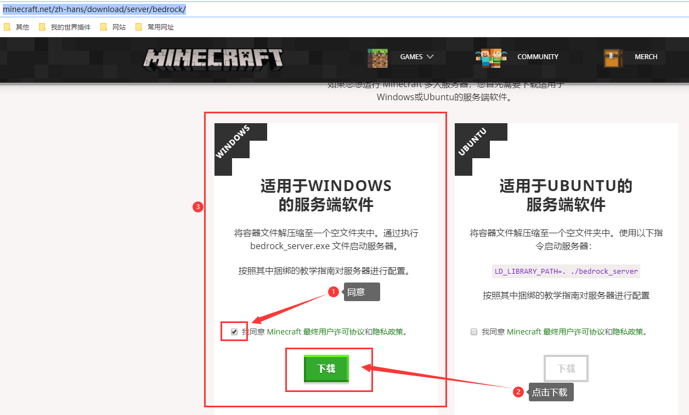
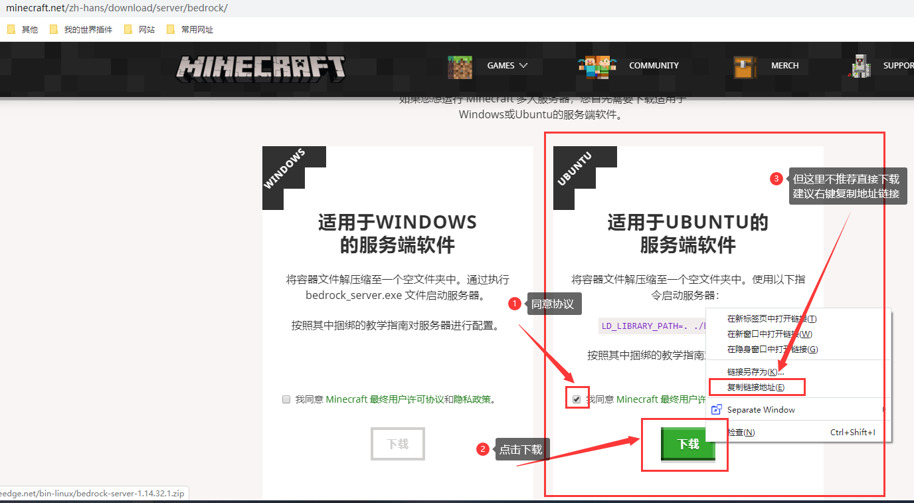

## 前期需要软件
1. 远程SSH控制台软件（本教程使用 Remote Terminal 此为win10商店软件）[[点我下载(此软件为Xshell)]](https://www.lanzoui.com/i88wyvi)
2. 支持Sftp的FTP软件（本教程使用 FileZilla）[[点我下载]](https://www.lanzoui.com/i88wyqd)
3. 服务端（本教程使用 官方bds服务端）
4. Centos或Ubuntu主机一台 （教程使用 centos7.9，但建议直接使用Ubuntu）

## 注意事项
1. 极力推荐Ubuntu系统，Centos需要另需环境。
2. 不支持 **Windows Server 2012** 及以下版本，要使用 **Windows 10** （可行）或者 **Windows Server 2016** 及以上版本运行
3. 我的世界基岩版端口为 **UDP协议的19132** 端口，如果使用其他端口请在配置文件中设置成其他端口
4. 请开放端口为 **UDP协议的19132** 端口，基岩版需要他进行通信(**列如阿里云、腾讯云需去安全组进行开放端口**) [若是虚拟机请改成其他端口，VPS运营商一般是不会给你常用端口的]

## Windows开服
1. 首先我们去Minecraft官方下载最新服务端
- [[前往官网]](https://www.minecraft.net/zh-hans/download/server/bedrock/)
- 点击左边的**Windows版**并**同意协议**下载

2. 解压后双击「bedrock_server.exe」文件即可
3. 下面就是需要内网穿透软件等来实现了(需要UDP协议)，但这个最好去找ECS或VPS租用服务器比较好

## Centos开服
1. 首先我们去Minecraft官方下载最新服务端
- [[前往官网]](https://www.minecraft.net/zh-hans/download/server/bedrock/)
- 点击右边的**Ubuntu版**并**同意协议**下载

2. 我们需要安装一些环境解压和下载所需程序
```bash
yum install wget unzip -y
```

3. 将我们**第一步**下载的整合包下载下来并解压

```bash
wget -c https://minecraft.azureedge.net/bin-linux/bedrock-server-1.18.12.01.zip
# 注意这可能不是最新的，具体怎么获得链接可以查看我第一步
unzip -q bedrock-server-1.18.12.01.zip -d /opt/bds
# 解压文件名请注意刚才的下载链接后缀
# 解压文件至 /opt/bds 目录下
```

4. 下载Docker来作为环境依赖
```bash
yum install -y yum-utils device-mapper-persistent-data lvm2
# 下载所需环境包
yum-config-manager --add-repo http://mirrors.aliyun.com/docker-ce/linux/centos/docker-ce.repo
yum install docker-ce docker-ce-cli containerd.io -y
# 使用阿里云Docker镜像源安装docker
systemctl start docker.service
# 启动Docker
docker pull ubuntu
# 拉取ubutu的镜像，如果不放心可以运行 
docker images
# 来查看是否拉取
docker run -dit -p 19132:19132/udp -v /opt/bds:/opt/bds --name=bds --restart=always ubuntu:latest /bin/bash
# 使用Ubuntu镜像创建一个名为 bds 的容器并映射 /opt/bds 目录
docker ps
# 查看是否正常运行
```
5. 进入Docker容器的终端进行接下来的操作

```bash
docker exec -it bds /bin/bash
```

6. 启动服务器

```bash
cd /opt/bds
# cd到第2步解压的位置
LD_LIBRARY_PATH=. ./bedrock_server
# 运行启动指令
```

## Ubuntu开服
1. 首先我们去Minecraft官方下载最新服务端
- [[前往官网]](https://www.minecraft.net/zh-hans/download/server/bedrock/)
- 点击右边的**Ubuntu版**并**同意协议**下载

2. 我们需要安装一些环境解压和下载所需程序
```bash
sudo apt-get update #先更新系统(如果出现问题安装失败的话)
apt-get install zip unzip wget -y
```
3. 将我们**第一步**下载的整合包下载下来并解压
```bash
wget -c https://minecraft.azureedge.net/bin-linux/bedrock-server-1.18.12.01.zip
# 注意这可能不是最新的，具体怎么获得链接可以查看我第一步
unzip -q bedrock-server-1.18.12.01.zip
# 解压文件名请注意刚才的下载链接后缀
```
4. 启动服务器
```bash
./bedrock_server
```

### 保持后台运行
先`stop`关闭服务器，我们使用screen软件来让服务器保持后台运行。
```
apt install screen
# 创建一个名为 bds 的窗口
screen -S bds
# 在此新终端窗口内启动服务器
./bedrock_server
```