## 本教程所需条件
### 下载对应的服务端核心
- [Spigot](https://getbukkit.org/download/spigot) [可以装插件]
- [paper](https://papermc.io/downloads) [可以装插件]
- [Forge](https://files.minecraftforge.net) [可以装MOD]

### JAVA8下载
- Linux系统可以参考我的上期教程[**[我的世界MCSM面板搭建]**](../linux/node.html#安装java8)
- Win系统下载最新的JAVA8地址 [[点我下载]](https://en.vessoft.com/software/windows/download/java)

## 配置服务器
### 插件端
- 本教程使用**Spigot**核心，其他核心原理基本一样

1. 下载服务端核心
- [Spigot](https://getbukkit.org/download/spigot) 
- [paper](https://yivesmirror.com/downloads/paper) 

2. 新建「记事本」，在记事本中输入以下内容并改名为`.bat`后缀后启动。
- 注意`Minecraft_Server.jar`换成你下载下来的核心文件名。
- 第一次可能会有点慢，他需要加载文件等

```bat
java -Xmx1024M -jar Minecraft_Server.jar nogui
```
当他自动关闭窗口文件夹呈现以下<br>
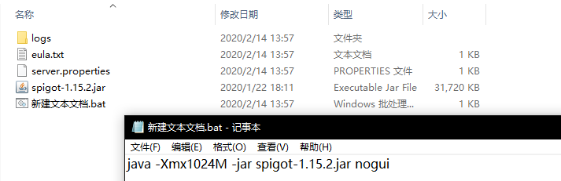

3. 编辑「eula.txt」文件，将`eula=false`设置为`eula=true`

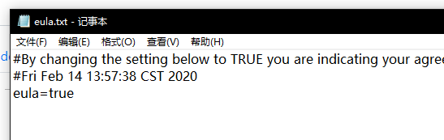

4. 在此双击运行`.bat`文件，但你看到下面的视图，那么就代表你成功了！

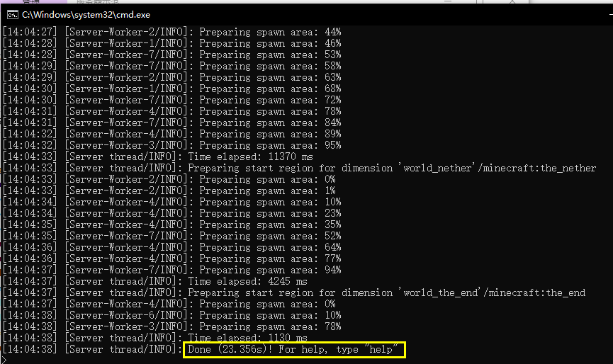

5. 在`server.properties`文件中你可能有些需要改的地方(改完记得重启)
```properties
gamemode=survival  //游戏模式 0=生存 1=创造 2=冒险 3=旁观
difficulty=easy  //难度0=和平 1=简单 2=普通 3=困难
max-players=20  //服务器最大玩家数限制
server-port=25565  //服务器端口
online-mode=true  //在线（正版）验证[默认启用]
```
#### 给服务器加插件
1. 去插件网站下载你需要的插件。
- [bukkit](https://dev.bukkit.org)
- [spigotmc](https://www.spigotmc.org)

2. 下载你需要的插件放入`plugins`，就可以了，对于怎么配置插件，在`plugins`文件夹中，会有与插件相同名字的文件夹，那里面的`config.yml`文件就是插件的配置文件，这里不过多讲述了，毕竟这个帮不了什么。

### MOD端
1. 首先去Forge官网，下载核心，这里以1.12.2版本作为示范。
- [Forge](https://files.minecraftforge.net)

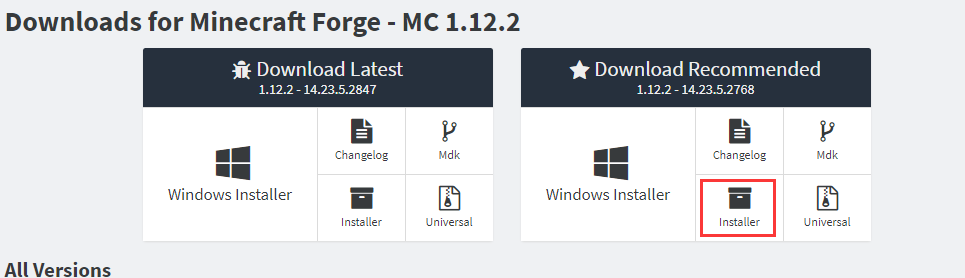
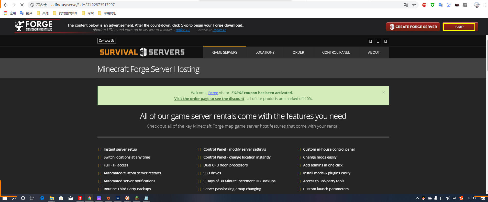

2. 下载官方核心去[我的世界Wiki百科](https://minecraft-zh.gamepedia.com/Java%E7%89%88%E7%89%88%E6%9C%AC%E8%AE%B0%E5%BD%95)中选择你的想要的版本点击他后右侧下载服务端

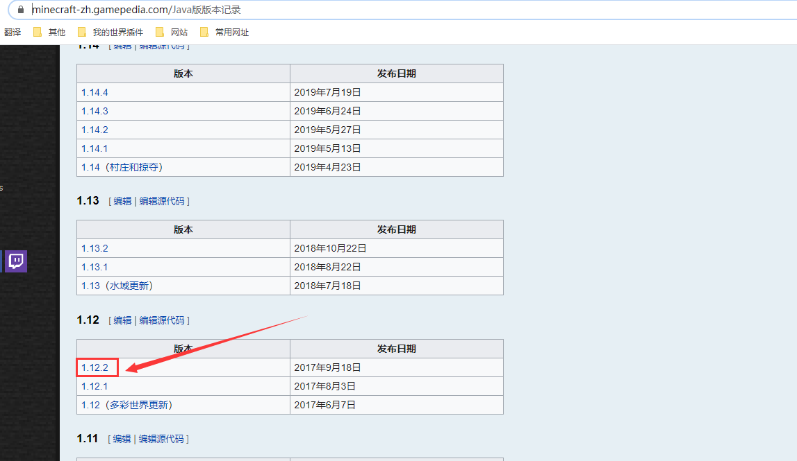
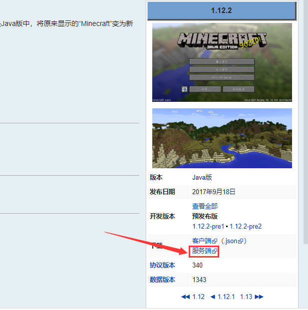

3. 将下载好的forge和服务端放在同一个目录下，修改服务端的文件名.
```
minecraft_server.xxx.jar   //xxx为版本号
```
- 并新建「记事本」，在记事本中输入以下内容并改名为`.bat`后缀后启动。
- **安装过程中会下载一些依赖库，由于某些原因可能会下载失败，多安装几次就行**

```bat
java -jar forge安装包文件名.jar --installServer
```
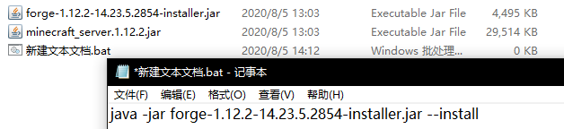
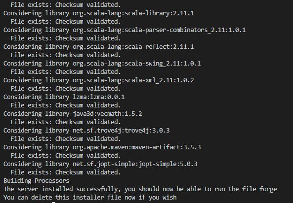

但他可能直接关闭窗口，查看`forge-xxx-installer.jar.log`文件日志的最后一行是否是`The server installed successfully, you should now be able to run the file forge`,是的话，就证明你安装成功了。

:::tip 来自博主的热心帮助
- **在这里`libraries`依赖库可以下载我下载好的[[蓝奏云下载地址]](https://vlssu.lanzoui.com/b0f1ate3i)（可省去大把时间）【注意这个只支持20年4月12日左右的依赖】**
- 因尝试无法全版本通用，最好挂梯子下（并结合日志将未下载成功的单独下）
:::

4. 编辑「记事本」，在记事本中输入以下内容后启动。
- 你可能注意到多出了一个核心将下面的`forge-xxx.jar`替换成多出来的那个核心文件名。
- 注意，一开始下的**installer**文件没有用了，多来的`forge-xxx.jar`是Forge服务器真正的核心
- 第一次可能会有点慢，他需要加载文件等

```bat
java -Xmx3G -jar forge-xxx.jar nogui
```
当他自动关闭窗口文件夹呈现以下<br>
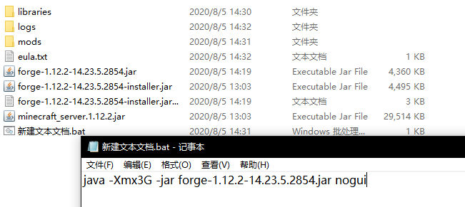

5. 编辑「eula.txt」文件，将`eula=false`设置为`eula=true`


6. 在此双击运行`.bat`文件，但你看到下面的视图，那么就代表你成功了！

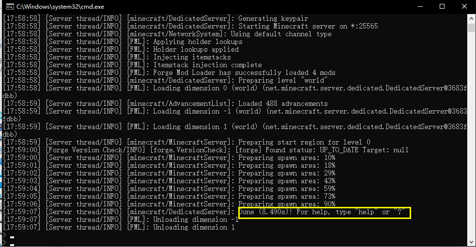

7. 在`server.properties`文件中你可能有些需要改的地方(改完记得重启)
```properties
gamemode=survival  //游戏模式 0=生存 1=创造 2=冒险 3=旁观
difficulty=easy  //难度0=和平 1=简单 2=普通 3=困难
max-players=20  //服务器最大玩家数限制
server-port=25565  //服务器端口
online-mode=true  //在线（正版）验证[默认启用]
```
#### 给服务器加MOD
1. 去MOD网站下载你需要的MOD。
- [curseforge](https://www.curseforge.com/minecraft/modpacks)

2. 下载你需要的插件放入`mods`，就可以了，对于怎么配置**MOD**呢，在`config`文件夹中，会有与MOD相同名字的文件或文件夹，当然你也可以不用配置默认即可，这里不过多讲述了，毕竟这个帮不了什么。

### Fabric端

1. 首先去Fabric官网，下载核心，这里以1.15.2版本作为示范。
- [Fabric](https://fabricmc.net/use/)

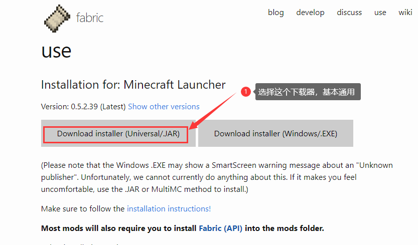

2. 下载官方核心去[我的世界Wiki百科](https://minecraft-zh.gamepedia.com/Java%E7%89%88%E7%89%88%E6%9C%AC%E8%AE%B0%E5%BD%95)中选择你的想要的版本点击他后右侧下载服务端


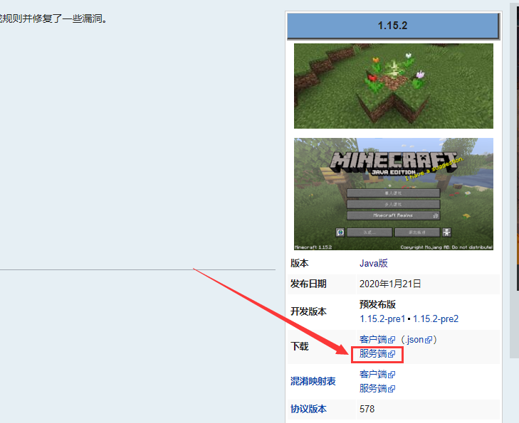

3. 将下载好的Fabric和服务端放在同一个目录下，**服务端的文件名不可修改**.

- 双击**fabric-installer-xxx.jar**  //xxx为版本号
- 选择服务端并点击「安装」

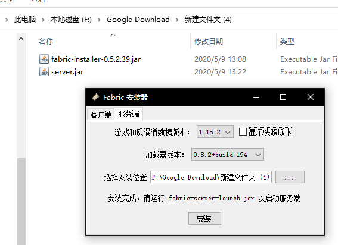

- 他会下载所需依赖，安装完成后他会弹出窗口
  - 第一个是下载纯净服务端(由于网络问题不可能会下载成功，这就是为什么之前让你们提前下载服务端)
  - 第二个是生成启动的bat或sh文件(这就舍去你的麻烦事了)

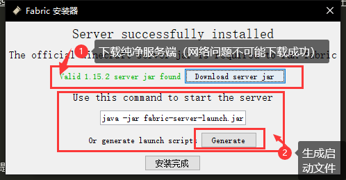

4. 启动服务器，对于说一句他启动的是`fabric-server-launch.jar`，面板用户启动这个这个核心。

5. 编辑「eula.txt」文件，将`eula=false`设置为`eula=true`


6. 在此双击运行`.bat`文件，但你看到下面的视图，那么就代表你成功了！

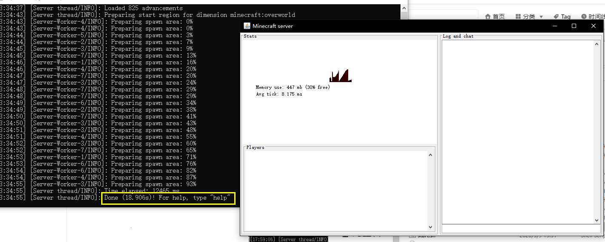

7. 在`server.properties`文件中你可能有些需要改的地方(改完记得重启)
```properties
gamemode=survival  //游戏模式 0=生存 1=创造 2=冒险 3=旁观
difficulty=easy  //难度0=和平 1=简单 2=普通 3=困难
max-players=20  //服务器最大玩家数限制
server-port=25565  //服务器端口
online-mode=true  //在线（正版）验证[默认启用]
```
#### 给服务器加MOD
1. 去MOD网站下载你需要的MOD。
- [curseforge](https://www.curseforge.com/minecraft/modpacks)

2. 下载你需要的插件放入`mods`，就可以了，对于怎么配置**MOD**呢，在`config`文件夹中，会有与MOD相同名字的文件或文件夹，当然你也可以不用配置默认即可，这里不过多讲述了，毕竟这个帮不了什么。