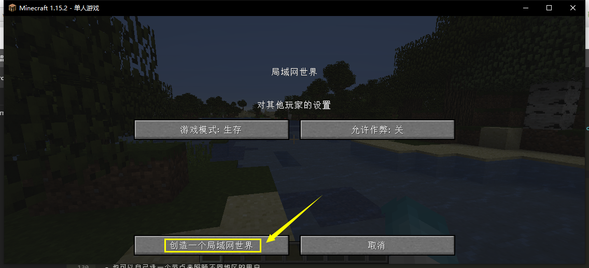

- VlssuSkin皮肤站一开始本用于我服后来公开化，也希望大家来使用我的皮肤站
- NetPlus是我接触的内网穿透项目，他可以让玩家在没有公网的基础上与朋友联机
- 离线版是无法使用客户端自带联机的，而皮肤站解决了这个问题

<!-- more -->

## 如何注册皮肤站

我们皮肤站地址[https://skin.vlssu.com](https://skin.vlssu.com/)

1. 首先进入皮肤站


2. 进行注册

理论上所有邮箱你都可以用来注册，但我们为了方便管理，请尽量用QQ邮箱

**注意！！** 正版无需注册，直接输入正版账户就完成了注册（并且皮肤、ID都会帮你配置好）


3. 你需要验证邮箱，否则你将无法使用账户


4. 你的ID已在你注册时填写过了，你也可以按需求去皮肤库选皮肤或自己上传皮肤

::: tip
那么这部分就讲完了，如果你需要皮肤站的详细说明，那么你可以去[**皮肤站用户使用手册**](https://skin.vlssu.com/manual/)去查看更详细的内容
:::

## 如何配置客户端

- 首先就是我们要注册皮肤站  [**点击这里去皮肤站**](https://skin.vlssu.com/auth/register)
- 在你注册完之后会进入[**用户中心**](http://skin.vlssu.com/user)
- 再根据下面相应客户端配置


#### 我们皮肤站的认证服务器地址(给不认真看的人看的)
```
https://skin.vlssu.com/api/yggdrasil
```

### HMCL-原版配置方案

以下以 HMCL 3 为例，演示在 Minecraft 客户端中使用 Yggdrasil。

1. 打开 HMCL 3 的「新建游戏账户」界面，选择登陆方式为「外置登录（authlib-injector）」。
如果这是你第一次打开 HMCL，这个界面将会在启动时弹出。


2. 点击「认证服务器」旁的加号「+」，输入 VlssuSkin 的 Yggdrasil API 地址，点击「下一步」，等待识别出 VlssuSkin 的 Yggdrasil 后点击「完成」。
如果你曾经添加过 VlssuSkin 的 Yggdrasil，你也可以在「认证服务器」菜单中直接选择 VlssuSkin。


3. 在「认证服务器」菜单中选择 VlssuSkin，填写你的邮箱和密码。「用户名」即为你在 VlssuSkin 的账号的邮箱。
如果你只添加了一个认证服务器，那么 HMCL 3 会默认选中那个唯一的认证服务器。


4. 设置完成啦！你可以启动游戏了。

### 正版启动器示例

以下以 Minecraft Launcher 为例，演示在 Minecraft 客户端中使用 Yggdrasil。

1. 首先你得是正版，然后再皮肤站绑定正版，如发现进不去，可以去皮肤站的[个人资料](https://skin.vlssu.com/user/profile)右上角进行更新**UUID**


2. 需要先下载`authlib-injector.jar`[【点击下载】](https://authlib-injector.yushi.moe/~download/)[【备用下载】](https://www.lanzoui.com/i4mzbqd)并放在你的游戏文件的根目录也就是`.minecraft`文件夹里（实际随你放哪）


3. 然后打开正版启动器的JVM参数进行设置

```
-javaagent:{绝对位置\authlib-injector.jar}=https://skin.vlssu.com/api/yggdrasil
```

- 这是我的参数，仅供参考

```
-javaagent:C:\Users\cmy13\AppData\Roaming\.minecraft\authlib-injector.jar=https://skin.vlssu.com/api/yggdrasil -Xmx8G -XX:+UnlockExperimentalVMOptions -XX:+UseG1GC -XX:G1NewSizePercent=20 -XX:G1ReservePercent=20 -XX:MaxGCPauseMillis=50 -XX:G1HeapRegionSize=32M
```


4. 设置完成啦！你可以启动游戏了

## 在服务端使用
VlssuSkin 提供 Yggdrasil 验证鉴权服务，你可以配合 [authlib-injector](https://github.com/yushijinhun/authlib-injector) 来实现 Minecraft 服务器外置登录，并在不安装皮肤 Mod 的情况下加载来自 VlssuSkin 的材质。

你可以在 [https://authlib-injector.yushi.moe/~download/](https://authlib-injector.yushi.moe/~download/) 下载到最新版本的 authlib-injector。

### Yggdrasil API 地址

VlssuSkin 的 Yggdrasil API 的地址是：

```
https://skin.vlssu.com/api/yggdrasil
```
### 在服务器中配置
请先将服务器配置文件（一般为 server.propties）中 `online-mode` 一项的值设为 `true`，然后在你的服务端的启动指令的 `-jar` 参数前添加如下参数：

```
-javaagent:{path/to/authlib-injector.jar}=https://skin.vlssu.com/api/yggdrasil
```

其中 `{path/to/authlib-injector.jar}` 为指向 authlib-injector 的路径。

::: tip
如果你使用 BungeeCord，你需要在所有服务端（包括 BungeeCord 和所有子服）中加载 authlib-injector（方法见上），但只有 BungeeCord 打开 `online-mode`，其他服务端应该关闭 `online-mode`。
:::

## 使用客户端联机
1. 使用「[外置登录](#如何配置客户端)」进入游戏
2. 首先进入存档后，打开「游戏菜单」的界面，点击菜单中的「对局域网开放」
3. 你可以先设置其他玩家进入你服务器是什么模式，也可以设置他们是否能使用作弊指令
4. 点击界面中的「创建一个局域网世界」，聊天栏会出现在你电脑上开放的**联机端口**





5. 将你开放的端口写入下面一个环节中的「内网端口」中，然后就可以复制地址让你的好友进入你的世界啦。<br>
**记住一定要使用「外置登录」哦**

## 如何使用NetPlus映射
[加入群聊【NetPlus·端口映射官方群】](https://jq.qq.com/?_wv=1027&k=5vvZx5E)

1. 打开 NetPlus 软件进入「映射管理」去「设置」映射信息


2. 设置映射信息
- 映射名称可以随便填，但要注意不可重复
- 内网IP一般默认即可，推荐「127.0.0.1」
- 内网端口根据游戏的不同设置不同的端口
  - JAVA版一般默认为25565，但如果是客户端会随机端口根据提示输入相应端口
- 映射节点推荐使用「自动优选」来自动设置延迟最低的节点
  - 也可以自己选一个节点来照顾不同地区的用户
  - 如果出现节点未显示的情况可以「刷新节点」将节点刷新出来
- 最后保存节点就大功告成了

