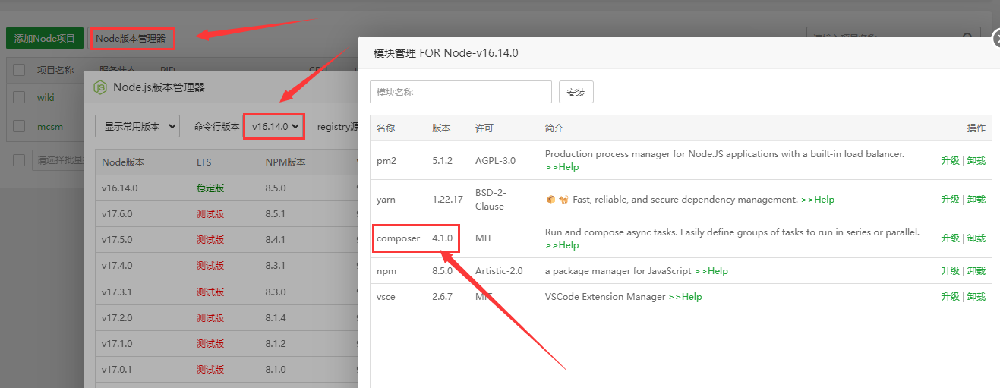

- Flarum论坛相对于其他论坛UI更简洁，也相对简单

<!-- more -->

## 官方教程
[原帖地址](https://docs.flarum.org/install)

## 服务器要求
在安装Flarum之前，重要的是要检查您的服务器是否符合要求。要运行Flarum，您将需要：

- Apache (启用mod_rewrite) 或 Nginx
- PHP 8.1+ 具有以下扩展名: curl, dom, gd, json, mbstring, openssl, pdo_mysql, tokenizer, zip
- MySQL 5.6+/8.0.23+ 或 MariaDB 10.0.5+
- SSH（命令行）访问以运行Composer

::: tip 共享主机

无法通过下载 ZIP 文件并将文件上传到您的 Web 服务器来安装 Flarum。这是因为 Flarum 使用了一个名为[Composer](https://getcomposer.org/)的依赖管理系统，它需要在命令行上运行。

这并不一定意味着您需要 VPS。大多数体面的主机都支持 SSH 访问，通过它你应该能够很好地安装 Composer 和 Flarum。
:::
## 安装
Flarum使用Composer来管理其依赖项和扩展。在安装Flarum之前，您需要在计算机上[安装Composer](https://getcomposer.org/)。然后，在您要安装Flarum的空白位置运行此命令：
```
composer create-project flarum/flarum .
```
运行此命令时，可以配置Web服务器。您需要确保将webroot设置为`/path/to/your/forum/public`，然后按照以下说明设置URL重写。

一切准备就绪后，请在网络浏览器中导航至您的论坛，然后按照说明完成安装。

### URL重写
>因为网站文件不在根目录，就需要你URL重写

#### Apache
Flarum在公共目录中包含`.htaccess`文件 - 确保已正确上载。 如果您正在使用共享主机，请与您的提供商确认已启用`mod_rewrite`且允许`.htaccess`文件。 如果您要管理自己的服务器，则可能需要将以下内容添加到站点配置中：
```
<Directory "/path/to/flarum/public">
    AllowOverride All
</Directory>
```
这确保了允许 htaccess 覆盖，因此 Flarum 可以正确地重写 URL。

启用方法`mod_rewrite`因您的操作系统而异。您可以通过`sudo a2enmod rewrite`在 Ubuntu 上运行来启用它。`mod_rewrite`在 CentOS 上默认启用。修改后不要忘记重启 Apache！
#### Nginx
Flarum包含`.nginx.conf`文件 – 确保它已正确上载。 然后，假设您在Nginx中设置了PHP站点，请将以下内容添加到服务器的配置块中：
```
include /path/to/flarum/.nginx.conf;
```
#### Caddy
Caddy需要非常简单的配置才能使Flarum正常工作。请注意，您应该使用自己的URL替换URL，并使用自己的public文件夹的路径替换path 。如果您使用的是其他版本的PHP，则还需要更改fastcgi路径以指向正确的PHP安装套接字或URL。
```
www.example.com {
    root * /var/www/flarum/public
    php_fastcgi unix//var/run/php/php7.4-fpm.sock
    header /assets {
        +Cache-Control "public, must-revalidate, proxy-revalidate"
        +Cache-Control "max-age=25000"
        Pragma "public"
    }
    file_server
}
```
### 文件夹所有权
在安装期间，Flarum 可能会要求您将某些目录设为可写。现代操作系统通常是多用户的，这意味着您登录的用户与运行 FLarum 的用户不同。运行 Flarum 的用户必须具有以下权限：

- 根安装目录，因此 Flarum 可以编辑`config.php`。
- 子目录，因此`storage`Flarum 可以编辑日志和存储缓存数据。
- `assets`子目录，以便可以将徽标和头像上传到文件系统。

扩展可能需要其他目录，因此您可能希望递归地授予对整个 Flarum 根安装目录的写访问权限。

您需要运行几个命令才能设置文件权限。请注意，如果您的安装在执行其中一些后没有显示警告，则您不需要运行其余的。

首先，您需要允许对该目录进行写访问。在 Linux 上

```
chmod 775 -R /path/to/directory
```

如果这还不够，您可能需要检查您的文件是否属于正确的组和用户。默认情况下，在大多数 Linux 发行版`www-data`中是 PHP 和 Web 服务器都在其下运行的组和用户。您需要查看您的发行版和网络服务器设置的细节以确保。您可以通过运行以下命令更改大多数 Linux 操作系统中的文件夹所有权：

```
chown -R www-data:www-data /path/to/directory
```

如果您的 Web 服务器使用`www-data`不同的用户/组，则更改为其他内容。

此外，您需要确保您的 CLI 用户（您登录终端的用户）拥有所有权，以便您可以通过 CLI 安装扩展和管理 Flarum 安装。为此，请通过将当前用户 (`whoami`) 添加到 Web 服务器组（通常`www-data`）`usermod -a -G www-data YOUR_USERNAME`。您可能需要注销并重新登录才能使此更改生效。

最后，如果这不起作用，您可能需要配置[SELinux](https://www.redhat.com/en/topics/linux/what-is-selinux)以允许 Web 服务器写入目录。为此，请运行：

```
chcon -R -t httpd_sys_rw_content_t /path/to/directory
```

::: warning 环境可能会有所不同
您的环境可能与所提供的文档有所不同，请向您的Web服务器配置或Web托管提供商咨询有关PHP和Web服务器所使用的正确用户和组的信息。
:::
::: danger 切勿使用权限777
永远不要将任何文件夹或文件设置为权限级别777，因为此权限级别允许任何人访问文件夹和文件的内容，而不管用户或用户组如何。
:::
### 汉化Flarum
没有中文？有中文补丁的（中文语言包也是有版本的哦）
在根目录输入
```
// 简体中文
composer require flarum-lang/chinese-simplified
php flarum cache:clear
//繁体中文
composer require csineneo/lang-traditional-chinese
```
好啦，这就是全部了，祝你使用愉快

## 使用宝塔搭建
宝塔linux7.0版本是基于centos7开发的，务必使用centos7.x 系统

### Linux面板7.9.2安装命令：
```bash
# Centos\Ubuntu安装命令：
curl -sSO http://download.bt.cn/install/install_panel.sh && bash install_panel.sh
```
### 安装环境
- Apache 2.4
- PHP 8.1+ （需手动安装以下扩展名：pdo_mysql）
- MySQL 5.7
- Pure-Ftpd 1.0.49
- phpMyAdmin 5.1
- PostgreSQL管理器 1.4 （安装最新版本）
- Node.js版本管理器 1.6

通过`Node.js版本管理器 1.6`安装`Composer`(直接安装模块那里输入名字安装即可)


### 安装Flarum+URL重写
Flarum使用Composer来管理其依赖项和扩展。在安装Flarum之前，您需要在计算机上[安装Composer](https://getcomposer.org/)。然后，在您要安装Flarum的空白位置运行此命令：
```
composer create-project flarum/flarum .
```
### URL重写
>运行此命令时，可以配置Web服务器。去 网站>站点设置>网站目录>运行目录>`/public`>保存

### 汉化Flarum
没有中文？有中文补丁的（中文语言包也是有版本的哦）
在根目录输入
```
// 简体中文
composer require flarum-lang/chinese-simplified
php flarum cache:clear
//繁体中文
composer require csineneo/lang-traditional-chinese
```
好啦，这就是全部了，祝你使用愉快

## 让Flarum支持中文搜索
MySQL 自5.7 开始支持FULLTEXT中文搜寻，重建索引即可

修改`mysql.cnf`，加入：

```ini
[mysqld]
ngram_token_size=2
```
修改后需要重建FULLTEXT 索引
```
ALTER TABLE flarum_posts DROP INDEX content;
CREATE FULLTEXT INDEX content ON `flarum_posts` (`content`) WITH PARSER ngram;

ALTER TABLE flarum_discussions DROP INDEX title;
CREATE FULLTEXT INDEX title ON `flarum_discussions` (`title`) WITH PARSER ngram;
```