我们都希望有个自己的随机图源，但是不会咋办呢，今天我就来教你们

这里我们以宝塔搭建为例

## 建立对象存储桶

我使用[又拍云对象存储](https://www.upyun.com/products/file-storage)来进行演示,原因也简单，可以获得10g免费容量和每月15g免费流量，当然得参加[加入又拍云联盟](https://www.upyun.com/league)。你也可以使用腾讯云cos以及阿里云oss，也有一定的免费额度，但是没有这个持久啊，不能永久白嫖多不好。

如果注册的话使用我的邀请码哈，[[点击我前往注册]](https://console.upyun.com/register/?invite=BJ71n3kxY)

建立好账号后进入[[又拍云云存储控制台]](https://console.upyun.com/services/file/)，点击创建服务。

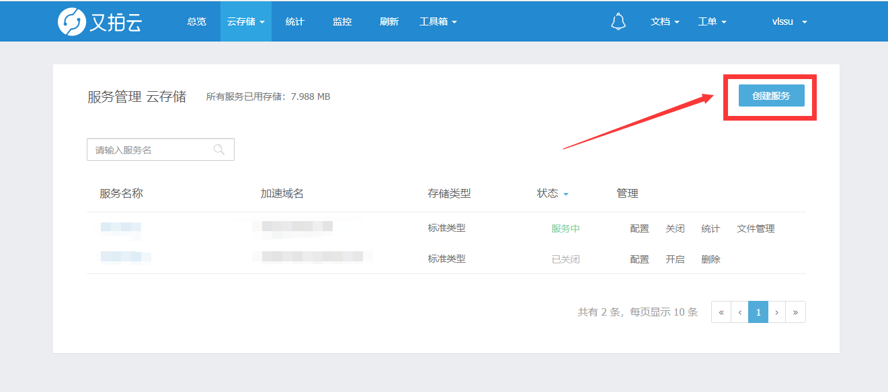

:::tip
- 服务器名称随便填，便于你的管理
- 应用场景选择`网页图片`
- 存储类型`标准存储`
- 加速区域按照自己的喜好
- 需要创建一个操作员并授权，注意**密码**只显示一次，请妥善保管
:::

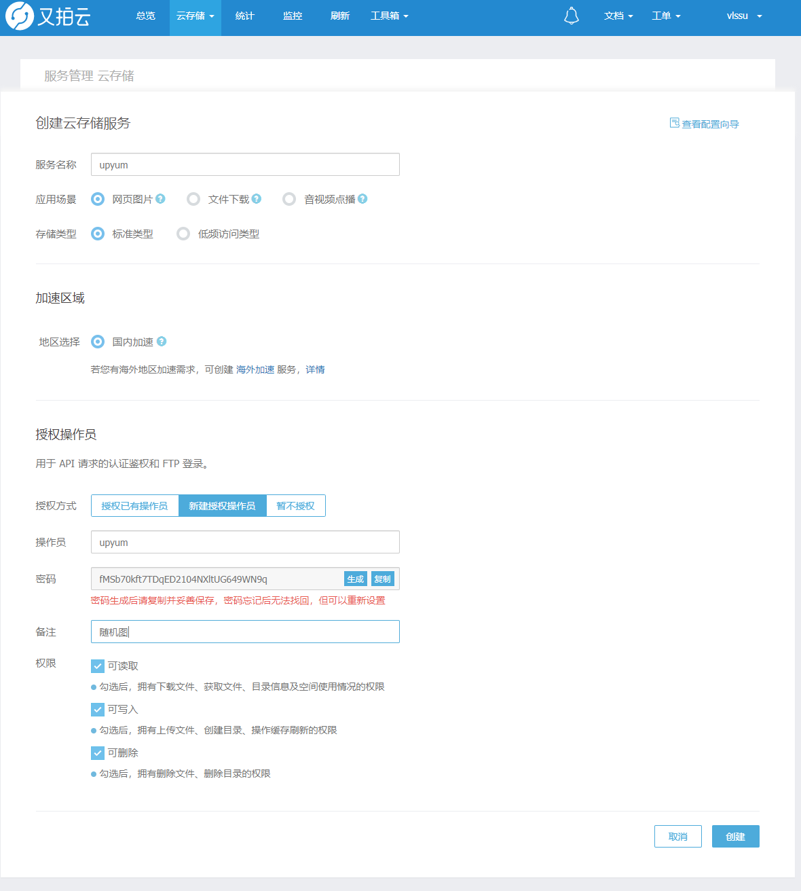

完成创建后，系统会自动分配测试加速域名，但！因为只有一个节点并且仅供测试使用，有不稳定的因素，因此不能使用在生产环境
<br>所以我们需要绑定域名 （此域名必须经过IPC备案）才能使用全部节点。点击域名绑定，输入已备案的域名，当然也可以使用二级域名。

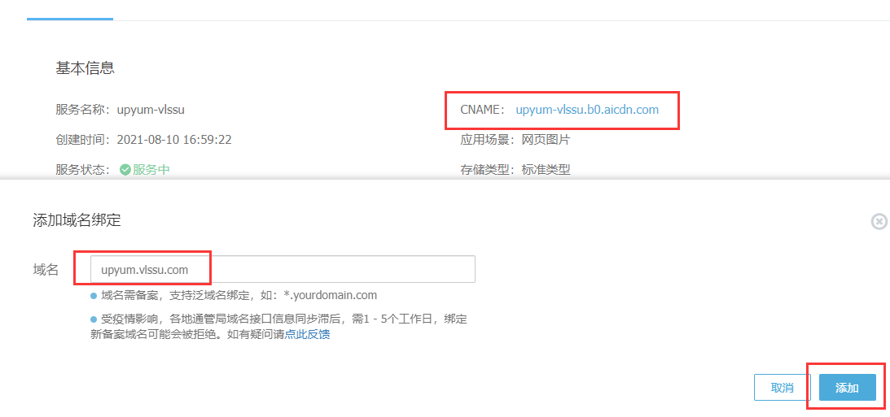

绑定成功后，需要在域名服务商添加一个`CNAME`解析，线路选择默认就完事了，填入又拍云提供的`CNAME`。

## 配置域名相关

1. 绑定`CNAME`
怎么绑定应该会吧？
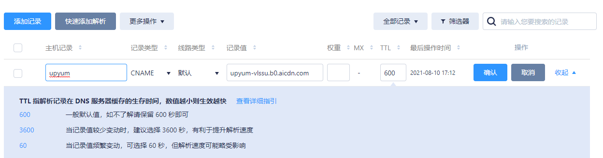

2. 设置HTTPS

功能配置-HTTPS-HTTPS 配置-管理-证书管理

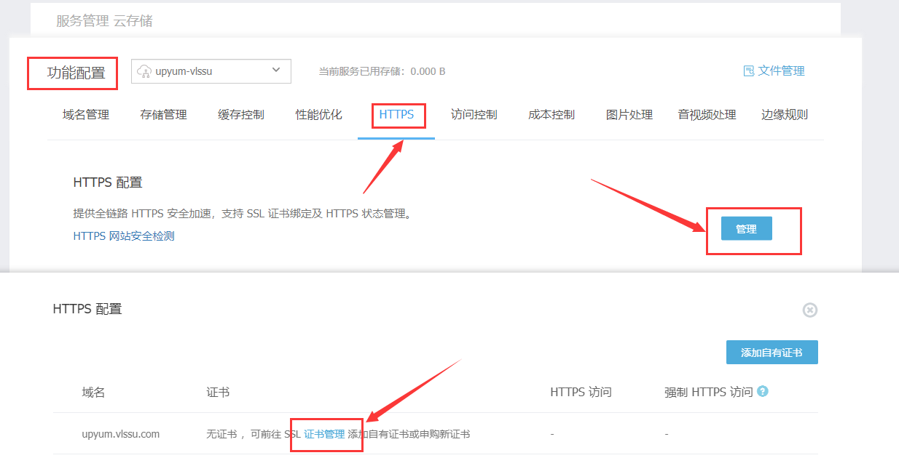

申请SSL证书 - **Let's Encrypt** - 创建订单

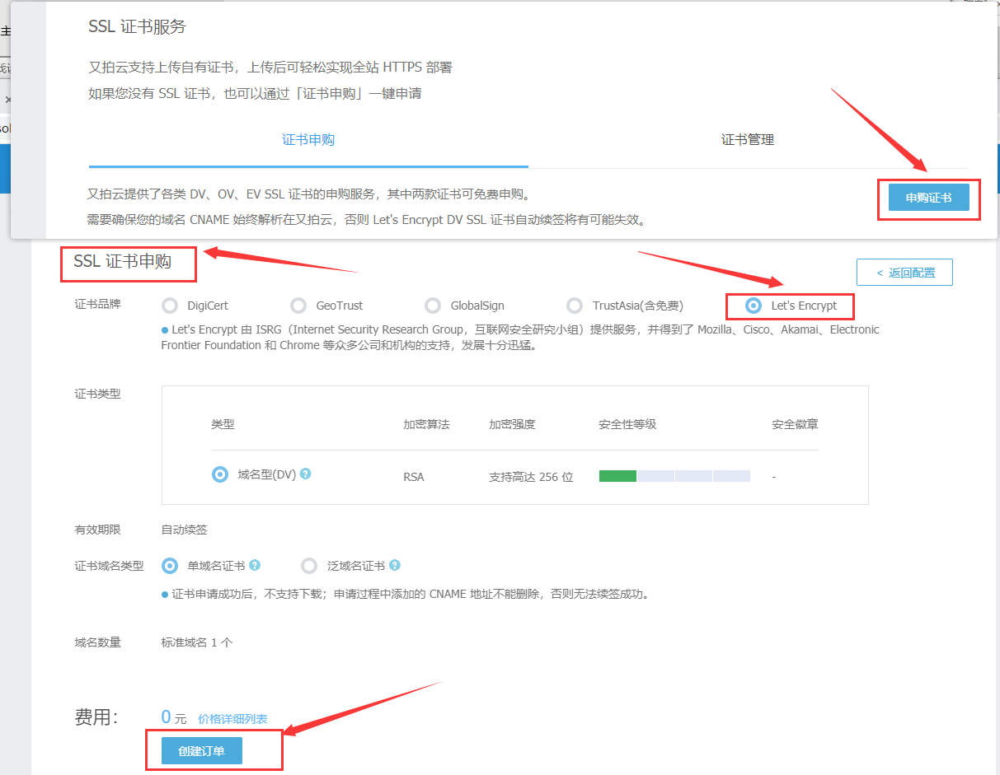

支付完成之后会跳转回去，证书类型里面会多出一个单域名证书，补全域名信息（前提是你的域名已经解析了库的域名，就可以开整了

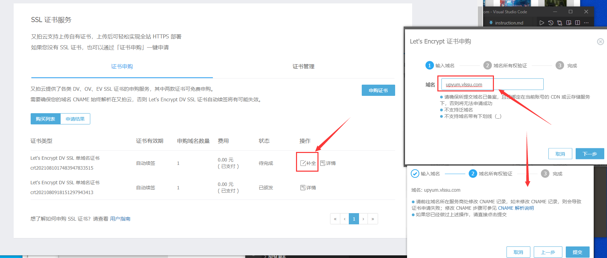

## 配置api前置需要

1. 你需要在库中新建一个目录，来管理你的图片，并上传

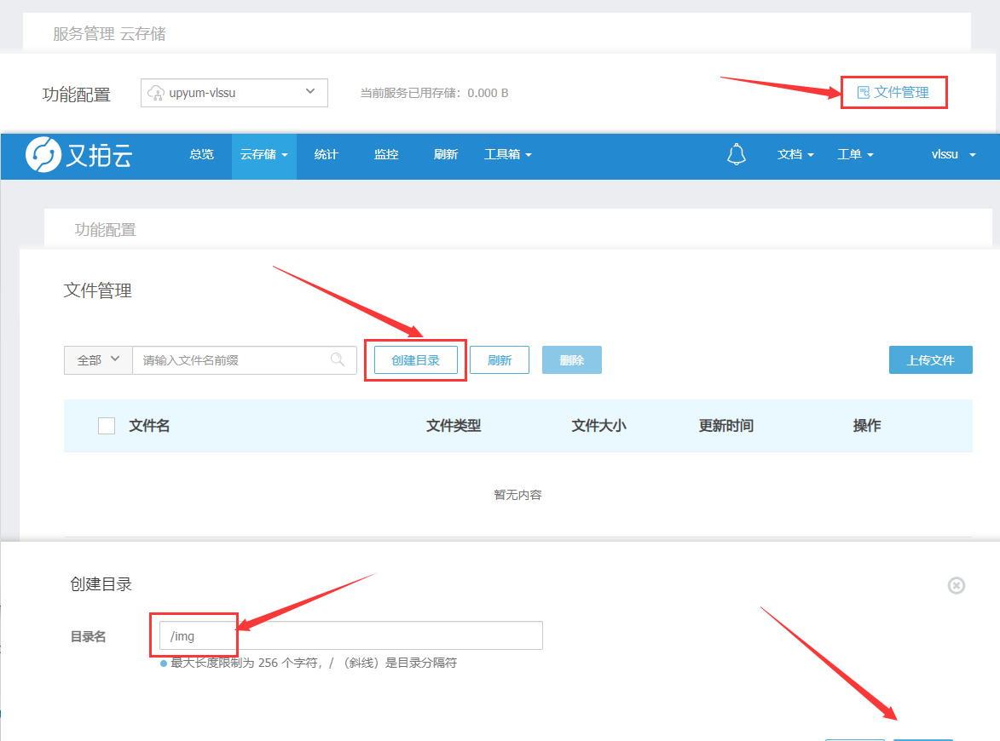

2. 到宝塔中，安装Python项目管理器并安装版本（这里安装的`3.8.5`）

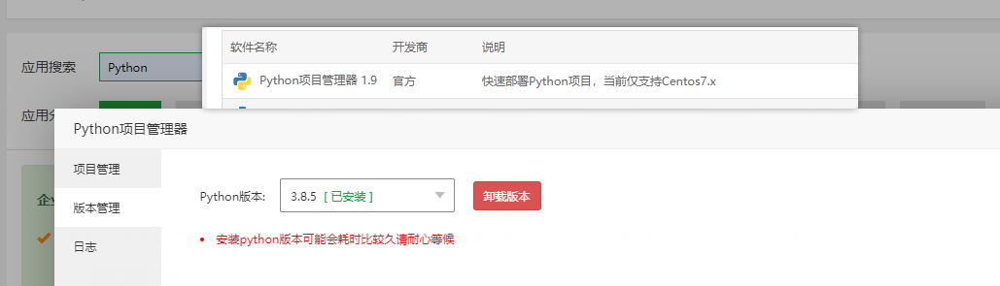

:::tip
|项目名称|随便起|
|:---:|:---:|
|路径|你的项目文件夹|
|Python版本|3.8.5|
|框架|python|
|启动方式|python|
|启动文件/文件夹|你的项目文件夹/autoUP.py|
|端口|空着|
:::

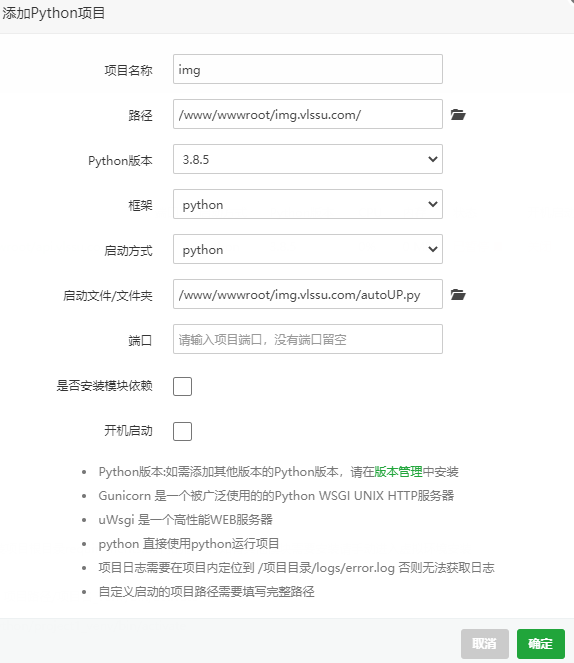

3. 设置模块
:::tip
手动添加
- requests
- upyun
:::

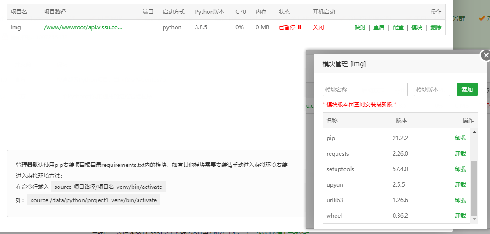

### 目录结构

```
img
├── index.php
├── autoUP.py
└── img.txt （执行autoUP.py生成文件）
```

### index.php文件内容
原理就是用py生成的txt来随机图片
```php
<?php

/**********************************************
* 文件名 : index.php
* 使用方法:
* 
* 
* ?2 这个2数字随便整，这样一个页面多处应用才能真正随机
***********************************************/

if (isset($_GET['folder'])) {
    $folder = (string)$_GET['folder'];
} else {
    $folder = 'nothumb';
}

//存有图片链接的文件名img.txt
$filename = "img.txt";
if(!file_exists($filename)){
    die('文件不存在');
}
 
//从文本获取链接
$pics = [];
$fs = fopen($filename, "r");
while(!feof($fs)){
    $line=trim(fgets($fs));
    if($line!=''){
        array_push($pics, $line);
    }
}
 
//从数组随机获取链接
$pic = $pics[array_rand($pics)];
 
//返回指定格式
$type = $_GET['type'] ?? '';
switch($type){
 
//JSON返回
case 'json':
    header('Content-type:text/json');
    die(json_encode(['pic'=>$pic]));
 
default:
    // die(header("Location: $pic"));
    header('Content-Type: image/png');
    echo(file_get_contents($pic));
}
?>
```

### autoUP.py文件内容
```py
import upyun
import os
service = 'upyum-vlssu' #服务名称
username = 'upyum' #操作员用户名
password = 'sdsadasdsagsrgsd' #操作员密码
path = '/randompics/' #填写你随机图片在又拍云对象存储里的路径
url = "https://upyum.vlssu.com" #填写你的cdn域名
file_path = "/www/wwwroot/api.vlssu.com/img.txt" #填写你img.txt 在服务器里面的路径
up = upyun.UpYun(service, username, password, timeout=30, endpoint=upyun.ED_AUTO) #初始化
res = up.getlist(path) #读取该目录下的图片列表
with open(file_path,'w') as f:
    for i in res:
        f.write(url + path + i["name"]+'\n')
```

### 运行脚本并自动化
在宝塔的计划任务中设置

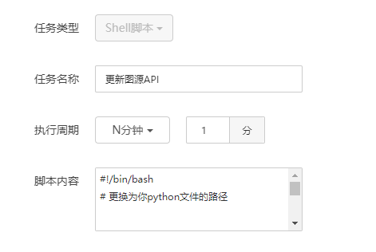

脚本内容
```bash
#!/bin/bash

#管理器默认使用pip安装项目根目录requirements.txt内的模块，如有其他模块需要安装请手动进入虚拟环境安装
#进入虚拟环境方法：
#在命令行输入 source 项目路径/项目名_venv/bin/activate
#如：source /data/python/project1_venv/bin/activate

# 根据Python项目管理器中的提示修改

source /www/wwwroot/api.vlssu.com/img_venv/bin/activate

# 更换为你python文件的路径

python /www/wwwroot/api.vlssu.com/autoUP.py
```

脚本借鉴 [ioalzx](https://ioalzx.site/ioalzx/tech/12/%E4%BD%BF%E7%94%A8%E5%AF%B9%E8%B1%A1%E5%AD%98%E5%82%A8%E5%92%8Ccdn%E5%8A%A0%E9%80%9F%E9%9A%8F%E6%9C%BA%E5%9B%BE%E7%89%87api/) 并加以修改
