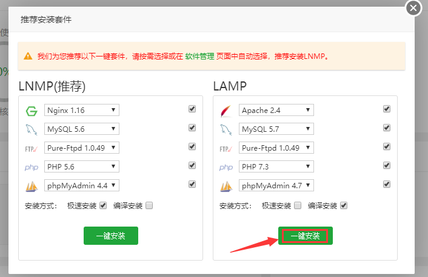
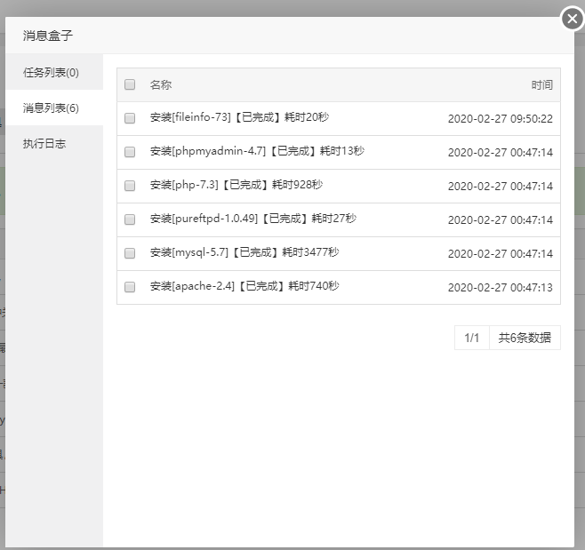
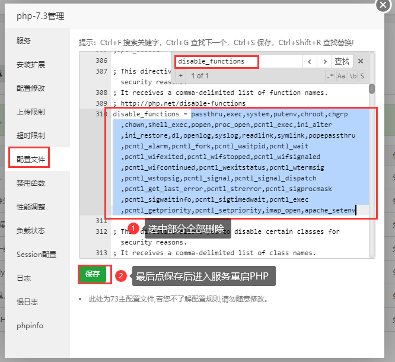
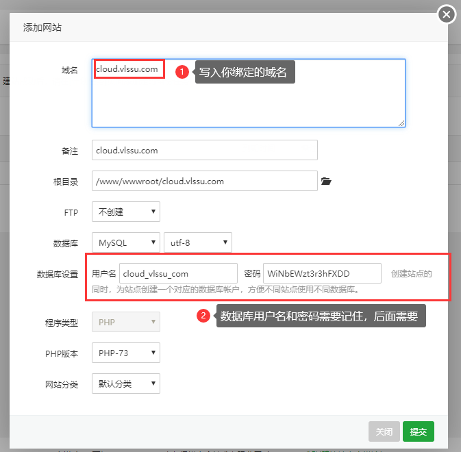
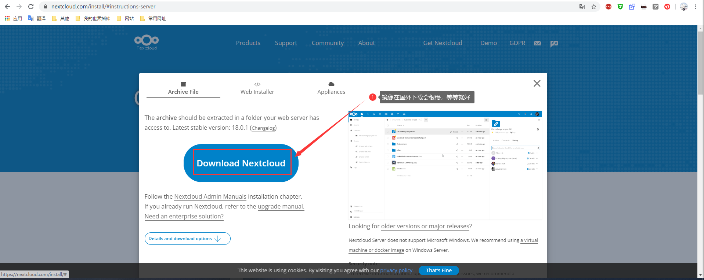
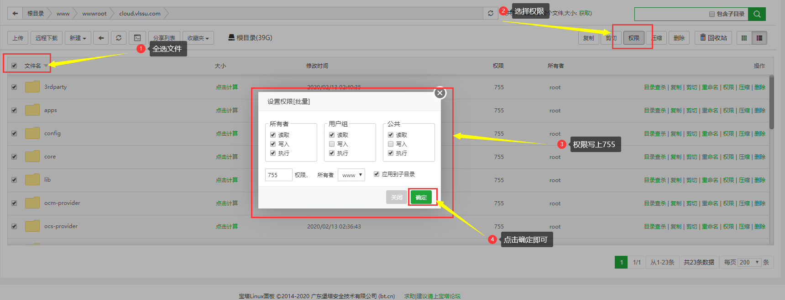
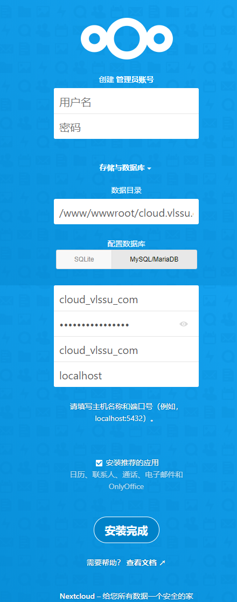
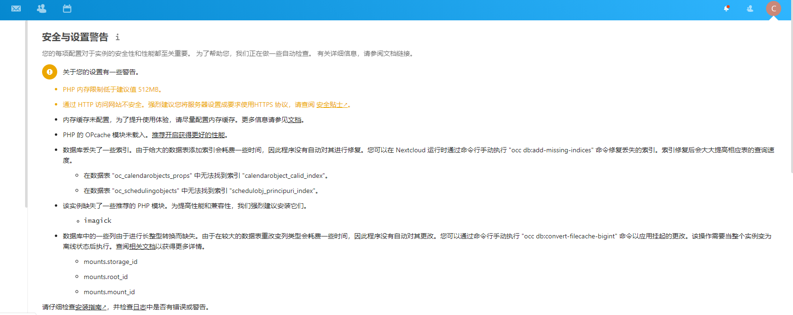

## 前期需要软件
1. 远程SSH控制台软件（本教程使用 Remote Terminal 此为win10商店软件）[[点我下载(此软件为Xshell)]](https://www.lanzoui.com/i88wyvi)
2. 支持Sftp的FTP软件（本教程使用 FileZilla）[[点我下载]](https://www.lanzoui.com/i88wyqd)
3. Centos或Ubuntu主机一台 （教程使用 centos7.7）

## 注意事项
1. 推荐Ubuntu系统（由于个人偏向，本教程使用Centos）
2. 未标注哪个系统指令则两者都可适用
3. 若标题注释了哪个系统那只能适用那个系统或另一个系统不需要输此指令

## 环境部署
### 系统更新
- 首先你要确保你的系统是最新的
```sh
yum update # (Centos)
//Ubuntu需要两条指令来升级
apt-get update -y # (Ubuntu)
apt-get upgrade -y # (Ubuntu)
```

### 宝塔安装
1. 使用指令安装
```sh
//Centos指令
yum install -y wget && wget -O install.sh http://download.bt.cn/install/install_6.0.sh && sh install.sh
//Ubuntu指令
wget -O install.sh http://download.bt.cn/install/install-ubuntu_6.0.sh && sudo bash install.sh
```
2. 安装所需环境
- 首次进入会让你安装基础程序【这里选**LAMP**个人喜欢这个，并且不需要自己添加伪静态】
  - 这里选择版本为：
  - Apache 2.4
  - MySQL 5.7
  - Pure-Ftpd 1.0.49
  - PHP 7.3(并安装扩展名: fileinfo)
  - phpMyAdmin 4.7
- 这里最好选**编译安装**，极速安装虽说快，但他不稳定，很不推荐.
- 下载速度日常很慢（根据服务器性能，我这里就是晚上弄然后睡觉去了）





3. 删除PHP中的禁用函数(现在的PHP和以前相比已经不需要禁用函数了，反而导致程序错误)
- 按下键盘**Ctrl+F**开启搜索功能搜索`disable_functions`，并删除后面的禁用函数，随后重启PHP。



4. 新建网站+数据库，并将数据库账户密码记录，在下文会使用到



5. 在SSH部署时需手动`cd`到网站目录并保证**目录为空**。(都面板化了，手动删除4个文件应该不费事吧)

## 安装Nextcloud
1. 克隆Nextcloud文件到本地
- 对于网盘系统有seafile、可道云，国外NextCloud，在自我衡量之后发现NextCloud更适合做网盘系统
- [[前往Nextcloud下载页]](https://nextcloud.com/install/#instructions-server)下载**NextCloud**安装包，并上传至服务器或`cd`到你要部署的文件夹自行下方命令
- **注意！** 链接非统一性，在官方随时更新版本链接随时变更，链接最好前往官方获取链接

```sh
wget -c https://download.nextcloud.com/server/releases/nextcloud-22.1.1.zip
```



2. 解压压缩包`nextcloud-22.1.1.zip`


3. 移动`nextcloud`内安装文件，迁移至网站目录


4. 删除无用文件的`nextcloud``nextcloud-18.0.1.zip`，不删除容易出错
```sh
rm -rf nextcloud
rm -rf nextcloud-18.0.1.zip
```
5. 变更权限组合权限，权限选择「755」+用户组选择「www」，最后确定即可



6. 直接打开自己绑定的域名，将上面用记下来的数据库用户名和密码写入相应的位置



7. 点击安装后就安装好啦

## 维护模式指令
```sh
sudo -u www php occ maintenance:mode --on
sudo -u www php occ maintenance:mode --off
```

## 解决后续问题
- 在「设置」中「管理栏」的选项中有「安全与设置警告」，实际上没多大事，如果有强迫症，下方可以解决



### PHP 内存限制低于建议值 512MB
:::tip
宝塔php点击**配置修改**，编辑`脚本内存限制`,给**512M**即可
:::
### PHP 的 OPcache 模块未载入。推荐开启获得更好的性能。
:::tip
按照提示在php配置文件中搜索Zend ZendGuard Loader，添加：
```ini
zend_extension=opcache.so
```
:::
### PHP 的组件 OPcache 没有正确配置。 为了提供更好的性能，我们建议在 php.ini中使用下列设置：
:::tip
宝塔php点击安装`opcache`。


:::
### 该实例缺失了一些推荐的 PHP 模块。为提高性能和兼容性，我们强烈建议安装它们。`imagick`
:::tip
宝塔php点击安装`imagemagick`。


:::
### 内存缓存未配置，为了提升使用体验，请尽量配置内存缓存。
:::tip
宝塔php点击安装`apcu` ，编辑`/config`下的`config.php`在`);`前加入以下代码：

```php
  'memcache.local' => '\OC\Memcache\APCu',
```
:::
### Nextcloud不能执行命令更新，报错如下：OC\HintException: [0]: Memcache \OC\Memcache\APCu not available for local cache
:::tip
宝塔软件商店 > PHP7.X > 配置文件 > 末尾的地方追加入以下代码：
```php
apc.enable_cli=1
```
然后重启电脑
:::
### 您的安装没有设置默认的电话区域。这对验证配置设定中没有国家代码的电话号码而言是必需的。要允许没有国家代码的电话号码，请添加带区域相应的 ISO 3166-1 code ↗ 的“默认_电话_区域”到你的配置文件中。
:::tip
编辑`/config`下的`config.php`在`);`前加入以下代码：
```php
  'default_phone_region' => 'CN',
),
```
:::
### 该实例缺失了一些推荐的 PHP 模块。为提高性能和兼容性，我们强烈建议安装它们。gmp
:::tip
宝塔php点击安装`gmp` 


:::
### 数据库中的一些列由于进行长整型转换而缺失。
:::tip
cd到nextcloud目录，执行
```sh
sudo -u www php occ db:convert-filecache-bigint
```
:::
### 数据库丢失了一些索引。
:::tip
cd到nextcloud目录，执行
```sh
sudo -u www php occ db:add-missing-indices
```
:::
### 美化URL，去除入口文件index.php
:::tip
使用config.php+OCC命令生成`.htaccess`。编辑`/config/config.php`添加规则：
```php
'htaccess.RewriteBase' => '/',
```
然后使用occ命令生成.htaccess文件：
```sh
sudo -u www php occ maintenance:update:htaccess
```
:::
### 通过 HTTP 访问网站不安全。强烈建议您将服务器设置成要求使用HTTPS 协议
:::tip
去证书网站申请证书即可。
:::
### HTTP的请求头 "Strict-Transport-Security" 未设置为至少 "15552000" 秒。为了提高安全性，建议参照security tips 中的说明启用HSTS。
:::tip
在站点配置文件里面添加如下代码，然后重启Apache即可。
```
Header always set Strict-Transport-Security "max-age=63072000; includeSubdomains; preload"
```
:::

## 安装后无法挂载外部共享目录
1. 安装PHP smbclient模块
2. 在php.ini里面启用smb模块
```
vim /usr/local/php/etc/php.ini
//文件最后添加如下内容：
[smb]
extension=/usr/local/php/lib/php/extensions/no-debug-non-zts-20160303/smbclient.so
```

## 性能优化
### 定时任务配置为 'Cron'
```bash
sudo -u www crontab -e
# 添加
*/5 * * * * php -f /站点的绝对路径/cron.php
# 这是我添加的，你们可以进行参考
*/5 * * * * php -f /www/wwwroot/cloud.vlssu.com/cron.php
lnmp restart
```

::: danger 无法正常运行
- 如果你是宝塔，那么大概率会出现这个问题，修复也很简单，原因是你根本登录不了`www`用户
- 当你输入`cat /etc/passwd | grep www`你会发现是`/sbin /nologin`
- 你知道替换为`/bin/bash`
```
# 进入该文件中
vi /etc/passwd
# 找到www那条，进行修改，将/sbin /nologin替换为/bin/bash
www:x:1001:1001::/home/www:/bin/bash
```
:::