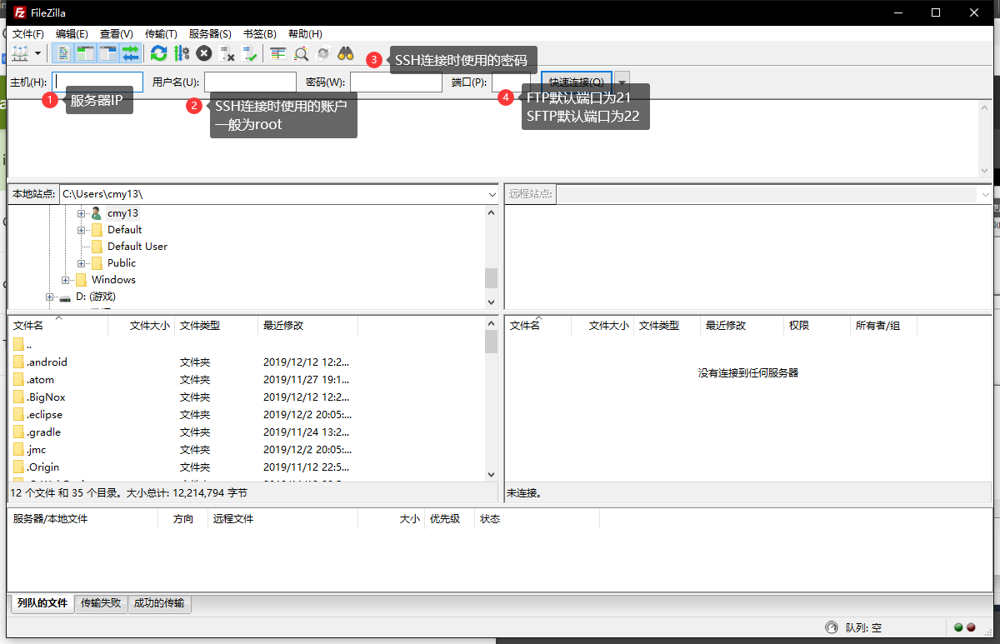

::: tip
1. windows虽然图形UI很不错但性能优化不理想
2. Centos、Ubuntu操作方面会指令话，大大节省时间
:::

<!-- more -->
:::: note 新的MCSManager 9.0
分布式，高扩展性，开箱即用，支持 Minecraft 和其他游戏的服务端管理面板
::: right
跳转至MCSManager 9.0文章 [师叔の小窝](./mcsm9.md)
:::
::::

::: tip
如果你并不想去学习如何自己搭建，可以使用源作者的安装指令（我的脚本没必要了）
::: details Linux 系统快速安装（适用于 Ubuntu/Centos/Debian/Arch）
安装成功后，使用 `systemctl start mcsm` 命令即可启动面板
```
wget -qO- https://gitee.com/Suwingser/MCSManager-installer/raw/master/install.sh | bash
```
:::

## 前期需要软件
1. 远程SSH控制台软件（本教程使用 Remote Terminal 此为win10商店软件）[[点我下载(此软件为Xshell)]](https://www.lanzoui.com/i88wyvi)
2. 支持Sftp的FTP软件（本教程使用 FileZilla）[[点我下载]](https://www.lanzoui.com/i88wyqd)
3. 服务端（本教程使用 Spigot）
4. Centos或Ubuntu主机一台 （教程使用 centos7.7）

## 注意事项

1. 极力推荐Centos系统，Ubuntu系统未经博主测试
2. 未标注哪个系统指令则两者都可适用
3. 若标题注释了哪个系统那只能适用那个系统或另一个系统不需要输此指令

## 环境部署
### 系统更新
- 首先你要确保你的系统是最新的
```bash
yum update # (Centos)
//Ubuntu需要两条指令来升级
apt-get update -y # (Ubuntu)
apt-get upgrade -y # (Ubuntu)
```

### 安装node.js

- **若发现国内下载很慢可以参考这篇来使用国内镜像部署**[**[Linux系统如何安装node管理器]**](../linux/node.html)

1. 安装Git
```bash
yum install git -y # (Centos)
apt install git # (Ubuntu)
```
2. 安装node.js管理器等组件
```bash
git clone https://github.com/creationix/nvm.git ~/nvm
# 设置nvm 自动运行
echo "source ~/nvm/nvm.sh" >> ~/.bashrc
source ~/.bashrc
# 安装npm的v13版本
nvm install v14.17.4
# 使用v13版本
nvm use v14.17.4
# 安装npm最新版本并使用最新版本 //由于面板问题无法使用最新的
# nvm install stable && nvm use stable
```
#### 请关闭终端重新打开或重新连接终端 再依次执行以下命令（重要！）
### 安装java8
- 如果要看更精细的步骤可以看这个文章 [[如何在Linux系统中安装Java8]](../linux/java8.html)

#### Centos
- 使用`yum`安装`java8`。

```bash
# 安装java8
yum install java-1.8.0-openjdk java-1.8.0-openjdk-devel
# 安装java11 按需安装，建议直接下载用绝对链接来开服
yum install java-11-openjdk java-11-openjdk-devel
# 查看java版本
java -version
```

#### Ubuntu
1. 安装`java8`
```bash
apt install openjdk-8-jdk
```
2. 如果我们在服务器上安装了多个Java版本，我们可以使用<b>update-alternatives</b>系统更改默认版本
```bash
sudo update-alternatives --config java
```
要维持当前值[*]请按<回车键>，或者键入选择的编号：<br>
在出现提示时输入号码并按Enter键。

3. 查看`java`版本
```bash
java -version
```

### 安装MCSM
- 克隆**MCSManager**并安装依赖
```bash
# 克隆目录
git clone -b v8.7.0 https://github.com/suwings/mcsmanager.git
# cd至目录
cd mcsmanager/
# 安装依赖库
npm install
# 启动面板
sudo npm start     # 如果已是root可不用输sudo
```

::: warning 注！启动面板注意事项
```bash
# 每次重启或关闭后需要重新CD到项目目录才能继续执行指令
cd mcsmanager/
# 启动面板
sudo npm start     # 如果已是root可不用输sudo
```
我以为这是常识，是我错了(我被小白所折服，哎)
:::

## 保持后台运行
先`Ctrl+C`关闭面板，我们使用`screen`软件来让面板保持后台运行。
```bash
yum install screen # (Centos)
apt install screen # (Ubuntu)
# 创建一个名为 mcsm 的窗口
screen -S mcsm
# 在此新终端窗口内启动面板
sudo npm start #或 sudo node app.js
```
直接断开终端连接即可，面板将保持后台运行。

<b>若要重新控制，请输入命令即可：</b>
```bash
screen -r mcsm
```
## 端口开放
面板需要 23333（主功能） 端口与 20010 - 20200（FTP功能）端口区间。

如果你使用阿里云，腾讯云或者服务商，<b>请进入控制台到防火墙安全组策略，放行以上端口。</b>

如果依然无法访问，请关闭系统自带防火墙：
```bash
# 关闭防火墙，依次执行
systemctl stop firewalld.service
systemctl disable firewalld.service
```
## 修改站点配置文件
在根目录的`./property.js`自带汉化，用户可自行修改
## 默认账户
现在，访问 http://你的ip:23333/ 即可进入面板。
```
# 开头带“#”为最高管理员权限（注意，管理员与管理员之间账号可互删）不带“#”为用户账户
默认账号：#master
默认密码: 123456
```
请及时修改密码。
## FTP连接
### 连接主机时

### 连接面板的FTP时


## 服务端
- [Spigot](https://getbukkit.org/download/spigot) [可以装插件]
- [paper](https://papermc.io/downloads) [可以装插件]
- [Forge](https://files.minecraftforge.net) [可以装MOD]
## 服务器插件/MOD
- [bukkit](https://dev.bukkit.org) [下载插件]
- [spigotmc](https://www.spigotmc.org) [下载插件]
- [curseforge](https://www.curseforge.com/minecraft/modpacks) [下载MOD]

## 计划任务项目
```
列如设置在每日凌晨3点执行一次：
* * 3 * * *

如果是想每隔3个小时执行一次：
* * */3 * * *

如果设置3月20号凌晨1点10分执行，并将执行次数设置为1。
* 10 1 20 3 *

具体使用方法如下：

* * * * * *
┬ ┬ ┬ ┬ ┬ ┬
│ │ │ │ │ │
│ │ │ │ │ └ 星期几（0-7）（0或7是星期日）
│ │ │ │ └───── 月（1-12）
│ │ │ └────────── 每月的某日（1-31）
│ │ └─────────────── 小时（0-23）
│ └──────────────────── 分钟（0-59）
└───────────────────────── 秒（0-59，可选）
```

## Docker 启动 Minecraft 服务端
- 如何安装Docker参考我这篇文章[[在Linux中安装Docker]](../linux/docker.html)
### 关闭SElinux
- 临时关闭SElinux

```bash
setenforce 0
```

- SElinux系统默认开启，如果不关闭会导致`Docker`无法访问项目目录
- 如何关闭Linux里面SElinux参考我这篇文章[[如何关闭Linux里面的SElinux]](../linux/selinux.html)

### 创建Docker

1. 使用`#master`账号登录
2. 进入 `服务端管理`
3. 选择中上方的 `创建虚拟镜像` 中创建 Docker 镜像。
4. 默认情况下，无需修改。点击 `创建镜像`
5. 最后。等待，速度与你网络有关，`任务结果列表` 显示成功则成功。

### 创建服务端

创建服务端十分简单，点击“引导创建服务端”即可。

通过里面的指引，创建你的 MC 服务器，稍后可以通过文件在线管理上传你的核心文件。


### 此端的 Docker 配置

1. 创建好服务端之后，点击这个服务器实例的【参数】然后到【docker 配置】
2. 勾上【此服务端启用 Docker 容器】选择框
3. 在【端口限制】中填写“25565:25565”即可，此意是开放 25565 端口。冒号两边一般情况下保持一致即可。
4. 保存

### 最后的操作

1. 回到服务端管理界面
2. 点击【管理】进入【文件在线管理】，上传你的核心文件。
3. 你已经给你的 Minecraft 服务端配置好了 Docker，现在只需要上传核心文件，然后启动就行啦！

- 启动时，Docker 容器会自动加载你的 Minecraft 服务端，保证安全性，稳定性。

### 写在最后

Docker 相关命令：

```bash
docker ps # 查看当前 Docker 进程
docker images # 查看当前 Docker 有哪些镜像（包括运行和未运行的）
docker kill mcsd # 强制杀死当前 Docker ，包括你的 Minecraft 服务端（失去控制时使用）
```